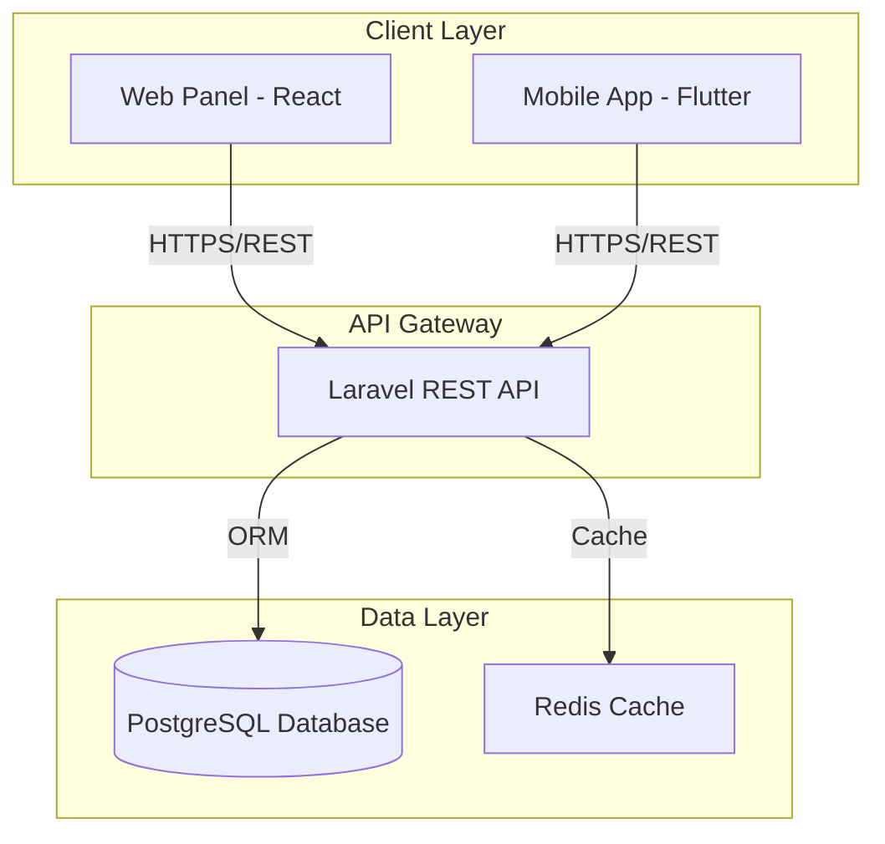

<div align="center">

# 💉 DripBlood System

### Modern Blood Donation Management Platform

[](https://github.com/jibanniraula/dripblood)
[](LICENSE)
[](https://reactjs.org/)
[](https://flutter.dev/)
[](https://laravel.com/)
[](https://www.docker.com/)

[Features](#-features) • [Tech Stack](#-tech-stack) • [Installation](#-installation) • [Documentation](#-documentation) • [Contributing](#-contributing)

---


</div>

## 📋 Table of Contents

- [About](#-about)
- [Features](#-features)
- [Tech Stack](#-tech-stack)
- [Architecture](#-architecture)
- [Installation](#-installation)
  - [Prerequisites](#prerequisites)
  - [Backend Setup](#backend-setup-laravel)
  - [Web Panel Setup](#web-panel-setup-react)
  - [Mobile App Setup](#mobile-app-setup-flutter)
- [Usage](#-usage)
- [API Documentation](#-api-documentation)
- [Project Structure](#-project-structure)
- [Screenshots](#-screenshots)
- [Roadmap](#-roadmap)
- [Contributing](#-contributing)
- [License](#-license)
- [Contact](#-contact)

---

## 🎯 About

**DripBlood** is a comprehensive blood donation management system designed to bridge the gap between blood donors, collectors, and medical facilities. Built with modern technologies and a microservices architecture, it provides a seamless experience across web and mobile platforms.

### The Problem

Traditional blood donation systems suffer from:
- ❌ Inefficient communication between donors and blood banks
- ❌ Lack of real-time inventory tracking
- ❌ Manual, error-prone record keeping
- ❌ Limited accessibility for field collectors

### The Solution

DripBlood offers:
- ✅ Real-time blood inventory management
- ✅ Mobile-first approach for field collectors
- ✅ Automated notifications and alerts
- ✅ Comprehensive analytics and reporting
- ✅ Offline-first mobile architecture
- ✅ Secure, role-based access control

---

## ✨ Features

### 🌐 Web Panel (Admin Dashboard)
- 📊 **Real-time Analytics** - Visualize donation trends, inventory levels, and demand patterns
- 👥 **User Management** - Manage donors, collectors, and administrators
- 🩸 **Blood Request Handling** - Approve, reject, and track blood requests
- 📈 **Advanced Reporting** - Generate custom reports with export capabilities
- 🔔 **Notification System** - Send alerts for urgent blood needs
- 🔐 **Role-Based Access** - Granular permissions for different user types

### 📱 Mobile App (Collector & Donor Interface)
- 📝 **Quick Donation Registration** - Register donations in seconds
- 🔍 **Blood Request Creation** - Submit and track blood requests
- 📍 **Event Locator** - Find nearby donation camps and events
- 📴 **Offline Support** - Works without internet, syncs automatically
- 🔔 **Push Notifications** - Instant alerts for urgent requests
- 📊 **Personal Dashboard** - View donation history and statistics

### 🔧 Backend API
- 🔒 **JWT Authentication** - Secure token-based authentication
- 🎭 **Role Management** - Admin, Collector, and Donor roles
- 💾 **Database Optimization** - Indexed queries for performance
- 📡 **RESTful APIs** - Clean, documented API endpoints
- 🐳 **Docker Support** - Containerized deployment
- 🔄 **Data Validation** - Comprehensive input validation and sanitization

---

## 🛠 Tech Stack

<table>
<tr>
<td align="center" width="33%">

### 🌐 Web Panel


</td>
<td align="center" width="33%">

### 📱 Mobile App


</td>
<td align="center" width="33%">

### ⚙️ Backend


</td>
</tr>
</table>

### Complete Tech Overview

| Component | Technology | Purpose |
|-----------|-----------|---------|
| **Frontend** | React 18+ | Modern, component-based UI |
| **Styling** | Tailwind CSS | Utility-first CSS framework |
| **Build Tool** | Vite | Fast development and build |
| **Mobile** | Flutter 3+ | Cross-platform mobile apps |
| **State Management** | GetX | Reactive state management |
| **Backend** | Laravel 10+ | RESTful API development |
| **Database** | PostgreSQL 15+ | Relational data storage |
| **Authentication** | JWT | Secure token-based auth |
| **Containerization** | Docker | Environment consistency |
| **Version Control** | Git | Source code management |

---

## 🏗 Architecture



### System Architecture Highlights

- **API-First Design**: All components communicate through RESTful APIs
- **Stateless Backend**: Enables horizontal scaling
- **Offline-First Mobile**: Local storage with background sync
- **Microservices Ready**: Modular architecture for future expansion
- **Security Layers**: JWT authentication, CORS, rate limiting

---

## 🚀 Installation

### Prerequisites

Ensure you have the following installed:

- **Docker** & **Docker Compose** (v20.10+)
- **Node.js** (v18+) & **npm** (v9+)
- **Flutter SDK** (v3.0+)
- **Git**

### Backend Setup (Laravel)

```bash
# Clone the repository
git clone https://github.com/jibanniraula/dripblood.git
cd dripblood1.0

# Navigate to backend directory
cd backend

# Copy environment file
cp .env.example .env

# Update .env with your configuration
# DB_CONNECTION=pgsql
# DB_HOST=postgres
# DB_PORT=5432
# DB_DATABASE=dripblood
# DB_USERNAME=postgres
# DB_PASSWORD=secret

# Start Docker containers
docker-compose up -d

# Install dependencies
docker-compose exec app composer install

# Generate application key
docker-compose exec app php artisan key:generate

# Run migrations
docker-compose exec app php artisan migrate

# Seed database (optional)
docker-compose exec app php artisan db:seed

# API will be available at http://localhost:8000
```

### Web Panel Setup (React)

```bash
# Navigate to React directory
cd ../react

# Install dependencies
npm install

# Copy environment file
cp .env.example .env

# Update API endpoint in .env
# VITE_API_URL=http://localhost:8000/api

# Start development server
npm run dev

# Web panel will be available at http://localhost:5173
```

### Mobile App Setup (Flutter)

```bash
# Navigate to Flutter directory
cd ../flutter

# Get dependencies
flutter pub get

# Update API endpoint in lib/config/api_config.dart
# static const String baseUrl = 'http://localhost:8000/api';

# Run on connected device or emulator
flutter run

# Or build APK
flutter build apk --release
```

---

## 📖 Usage

### For Administrators (Web Panel)

1. **Login** at `http://localhost:5173`
   - Default credentials: `admin@dripblood.com` / `password`

2. **Dashboard Overview**
   - View real-time blood inventory
   - Monitor active requests
   - Check system statistics

3. **Manage Users**
   - Add/edit donors and collectors
   - Assign roles and permissions
   - View donation histories

4. **Handle Requests**
   - Approve urgent blood requests
   - Match donors with requests
   - Track fulfillment status

### For Collectors (Mobile App)

1. **Download** the DripBlood app from your device
2. **Login** with collector credentials
3. **Register Donations**
   - Scan donor ID or search by name
   - Record blood type and quantity
   - Add notes and location
4. **Sync Data** when online

### For Donors (Mobile App)

1. **Register** as a new donor
2. **Complete Profile** with blood type and medical history
3. **Request Blood** when needed
4. **Find Events** near your location
5. **Track** your donation history

---

## 📡 API Documentation

### Authentication Endpoints

```http
POST /api/auth/register
POST /api/auth/login
POST /api/auth/logout
POST /api/auth/refresh
GET  /api/auth/me
```

### Blood Management Endpoints

```http
GET    /api/blood-inventory
POST   /api/blood-donations
GET    /api/blood-donations/{id}
PUT    /api/blood-donations/{id}
DELETE /api/blood-donations/{id}
```

### Request Management Endpoints

```http
GET    /api/blood-requests
POST   /api/blood-requests
GET    /api/blood-requests/{id}
PUT    /api/blood-requests/{id}/approve
PUT    /api/blood-requests/{id}/reject
```

### User Management Endpoints

```http
GET    /api/users
POST   /api/users
GET    /api/users/{id}
PUT    /api/users/{id}
DELETE /api/users/{id}
```

> 📘 **Full API Documentation**: Available at `http://localhost:8000/api/documentation` when backend is running

---

## 📁 Project Structure

```
dripblood1.0/
│
├── backend/                    # Laravel Backend
│   ├── app/
│   │   ├── Http/
│   │   │   ├── Controllers/    # API Controllers
│   │   │   └── Middleware/     # Custom Middleware
│   │   ├── Models/             # Eloquent Models
│   │   └── Services/           # Business Logic
│   ├── database/
│   │   ├── migrations/         # Database Migrations
│   │   └── seeders/            # Database Seeders
│   ├── routes/
│   │   └── api.php             # API Routes
│   ├── docker-compose.yml      # Docker Configuration
│   └── .env.example            # Environment Template
│
├── react/                      # React Web Panel
│   ├── src/
│   │   ├── components/         # Reusable Components
│   │   ├── pages/              # Page Components
│   │   ├── services/           # API Services
│   │   ├── hooks/              # Custom Hooks
│   │   ├── utils/              # Utility Functions
│   │   └── App.jsx             # Main App Component
│   ├── public/                 # Static Assets
│   ├── package.json
│   └── vite.config.js
│
├── flutter/                    # Flutter Mobile App
│   ├── lib/
│   │   ├── controllers/        # GetX Controllers
│   │   ├── models/             # Data Models
│   │   ├── screens/            # App Screens
│   │   ├── services/           # API Services
│   │   ├── widgets/            # Reusable Widgets
│   │   └── main.dart           # Entry Point
│   ├── assets/                 # Images, Fonts, etc.
│   └── pubspec.yaml
│
├── docker/                     # Docker Configurations
│   ├── nginx/
│   └── postgres/
│
├── database/                   # Shared Database Schema
│   └── schema.sql
│
├── docs/                       # Documentation
│   ├── API.md
│   ├── DEPLOYMENT.md
│   └── CONTRIBUTING.md
│
├── README.md                   # This File
├── LICENSE
└── .gitignore
```

---

## 📸 Screenshots

<details>
<summary><b>Click to view screenshots</b></summary>

### Web Panel Dashboard


### Mobile App - Donation Screen


### Blood Request Management


</details>

---

## 🗺 Roadmap

### Version 1.1 (Q2 2026)
- [ ] Real-time notifications for urgent blood requests
- [ ] QR code verification for donor authentication
- [ ] Blood donation camp scheduler
- [ ] SMS integration for non-app users

### Version 1.2 (Q3 2026)
- [ ] Advanced analytics dashboard with ML predictions
- [ ] Multi-language support (Nepali, Hindi, English)
- [ ] Integration with hospital management systems
- [ ] Donor rewards and gamification

### Version 2.0 (Q4 2026)
- [ ] AI-powered donor matching
- [ ] Blockchain-based donation certificates
- [ ] Mobile wallet integration
- [ ] International blood bank network

---

## 🤝 Contributing

We welcome contributions from the community! Here's how you can help:

### Ways to Contribute

1. 🐛 **Report Bugs** - Submit detailed bug reports
2. 💡 **Suggest Features** - Share your ideas for improvements
3. 📝 **Improve Documentation** - Help us make docs better
4. 💻 **Submit Pull Requests** - Contribute code

### Contribution Process

```bash
# Fork the repository
# Create a feature branch
git checkout -b feature/amazing-feature

# Make your changes
git commit -m "Add amazing feature"

# Push to your fork
git push origin feature/amazing-feature

# Open a Pull Request
```

### Coding Standards

- Follow PSR-12 for PHP code
- Use ESLint configuration for JavaScript/React
- Follow Flutter/Dart style guide
- Write meaningful commit messages
- Add tests for new features

> 📖 See [CONTRIBUTING.md](docs/CONTRIBUTING.md) for detailed guidelines

---

## 📄 License

This project is licensed under the **MIT License** - see the [LICENSE](LICENSE) file for details.

```
MIT License

Copyright (c) 2026 Jiban Niraula

Permission is hereby granted, free of charge, to any person obtaining a copy
of this software and associated documentation files (the "Software"), to deal
in the Software without restriction...
```

---

## 👨‍💻 Author

<div align="center">

### Jiban Niraula

**Full-Stack Developer | Healthcare Tech Enthusiast**

Building practical solutions that save lives and improve healthcare accessibility.

[](https://github.com/jibanniraula)
[](https://linkedin.com/in/jibanniraula)
[](mailto:jiban@dripblood.com)

</div>

---

## 🙏 Acknowledgments

- Blood banks and healthcare workers who inspired this project
- Open-source community for amazing tools and libraries
- Beta testers who provided valuable feedback
- Contributors who helped improve the system

---

## 📞 Contact

### Support

- 📧 **Email**: support@dripblood.com
- 💬 **Discord**: [Join our community](https://discord.gg/dripblood)
- 🐛 **Issues**: [GitHub Issues](https://github.com/jibanniraula/dripblood/issues)
- 📖 **Documentation**: [docs.dripblood.com](https://docs.dripblood.com)

### Social Media

- **Twitter**: [@dripblood](https://twitter.com/dripblood)
- **Facebook**: [DripBlood Community](https://facebook.com/dripblood)
- **Instagram**: [@dripblood.official](https://instagram.com/dripblood.official)

---

<div align="center">

### ⭐ Star this repository if you find it helpful!

**Made with ❤️ by Jiban Niraula**

*Saving lives, one drop at a time.*

---


</div>
